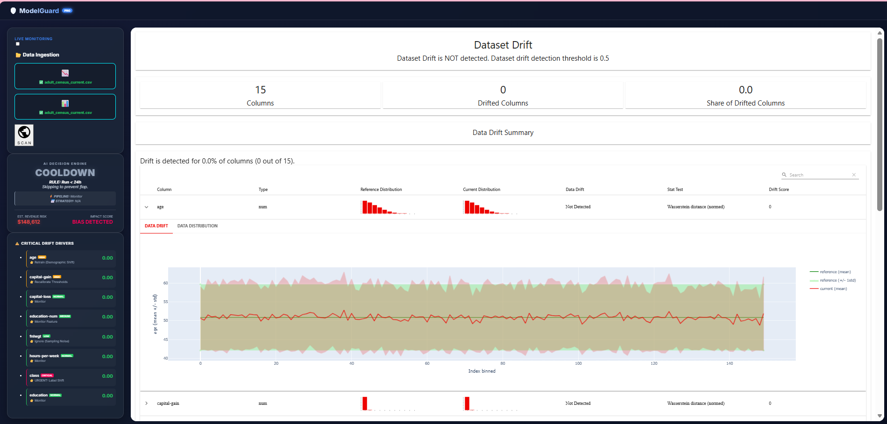
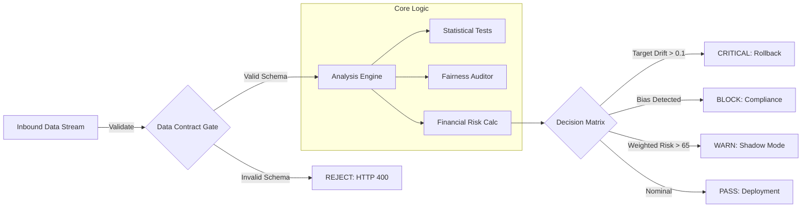

<div align="center">
  
  <h1>ModelGuard AI</h1>
  <h3>Enterprise ML Observability & Remediation Platform</h3>

  <p>
    <a href="#">
      
    </a>
    <a href="#">
      
    </a>
    <a href="#">
      
    </a>
    <a href="#">
      
    </a>
    <a href="#">
      
    </a>
  </p>
</div>

---

## System Demonstration

<div align="center">
  <video src="demovideo.mp4" controls width="100%"></video>
  <p><em>Figure 1: Real-time drift analysis triggering the automated circuit breaker.</em></p>
</div>


*Figure 2: The ModelGuard Operator Interface illustrating feature drift quantification.*

---

## Executive Summary

**ModelGuard AI** operates as an automated Reliability Engineer for production Machine Learning pipelines. Unlike passive monitoring tools that simply visualize data, ModelGuard employs **Causal Logic** to quantify financial risk, enforce strict **Data Contracts**, and autonomously execute remediation strategies (Rollback, Shadow Mode, Retraining).

The platform introduces a **Circuit Breaker** architecture designed to prevent catastrophic failure modes—specifically Target Drift—that aggregate metrics frequently fail to detect.

---

## Architectural Design

The system follows a linear reliability pipeline, acting as middleware between data ingestion and model inference.



---

## Comparative Analysis

ModelGuard shifts the focus from observation to action.

| Feature | Traditional Monitoring | ModelGuard AI |
| :--- | :--- | :--- |
| **Logic Model** | Passive Observation | Active Deterministic Remediation |
| **Alerting** | Threshold-based Noise | Business-Impact Weighted |
| **Data Quality** | Post-Mortem Debugging | Pre-Ingestion Data Contracts |
| **Metrics** | Aggregate Drift Scores | Target-Aware Risk Scoring |
| **Governance** | Manual Review | Automated Fairness Circuit Breakers |

---

## Decision Matrix & Automated Governance

The platform converts statistical signals into binary operational actions using the following logic gates:

| Signal Severity | Trigger Condition | System Action | Operational Impact |
| :--- | :--- | :--- | :--- |
| **CRITICAL** | `Target Drift > 0.1` | **ROLLBACK** | Immediate traffic termination to prevent invalid inference. |
| **HIGH** | `DIR < 0.8` | **BLOCK** | Deployment halted due to violation of 4/5ths fairness rule. |
| **MEDIUM** | `Risk Score > 65` | **SHADOW** | Traffic routed to canary model for parallel evaluation. |
| **LOW** | `Contract Violation` | **REJECT** | Ingestion API returns 400 Error to upstream producer. |

---

## Financial Risk Quantification

ModelGuard translates technical drift metrics into estimated financial impact using a heuristic cost-basis model.

$$ \text{Revenue Risk} = \text{Volume} \times \text{AvgCost} \times (\alpha \cdot D_{feature} + \beta \cdot D_{target}) $$

**Where:**
*   **Volume**: Throughput of the current batch.
*   **AvgCost**: Business cost of a False Prediction ($150.00).
*   **D**: Drift Score (0.0 - 1.0).
*   **Alpha/Beta**: Correlation coefficients for feature vs. target drift.

---

## Technology Stack

| Component | Technology | Role |
| :--- | :--- | :--- |
| **API Server** | `FastAPI` + `Uvicorn` | High-concurrency asynchronous ingestion. |
| **Validation** | `Pydantic` | Strict schema enforcement and type checking. |
| **Computation** | `SciPy` + `NumPy` | Kolmogorov-Smirnov tests and P-Value calculation. |
| **Drift Detection** | `Evidently AI` | Statistical profiling and distance measurement. |
| **State Store** | `SQLite` | Audit logging, versioning, and cooldown management. |
| **Frontend** | `Vanilla JS` + `CSS3` | Lightweight, dependency-free visualization layer. |

---

## Deployment & Usage

### Local Initialization

```bash
# 1. Clone Repository
git clone https://github.com/SalmaTech-03/Ai-model-quality-analyzer.git

# 2. Setup Environment
python -m venv venv
source venv/bin/activate
pip install -r requirements.txt

# 3. Hydrate Data
python scripts/download_data.py

# 4. Launch Service
uvicorn app.main:app --reload
```

### Docker Execution

```bash
docker-compose up --build
```

### SQL Analyst Interface

ModelGuard exposes an embedded SQL engine for root-cause analysis on ingested batches.

**Endpoint:** `POST /api/sql`
```sql
SELECT occupation, COUNT(*) as volume
FROM current_table
WHERE income = '>50K'
GROUP BY occupation
ORDER BY volume DESC
LIMIT 5;
```

---

## Project Structure

```text
├── app/
│   ├── api/            # API Route Definitions
│   ├── core/           # Mathematical & Logic Engines
│   ├── static/         # Dashboard Assets
│   └── main.py         # App Entry Point
├── data/               # Local Data Storage
├── tests/              # Pytest Suite
├── docker-compose.yml  # Container Orchestration
└── requirements.txt    # Dependency Manifest
```

---

<div align="center">
  <p><strong>Developed by Salma S</strong></p>
  <p>Machine Learning Engineer | Systems Architect</p>
</div>
```
