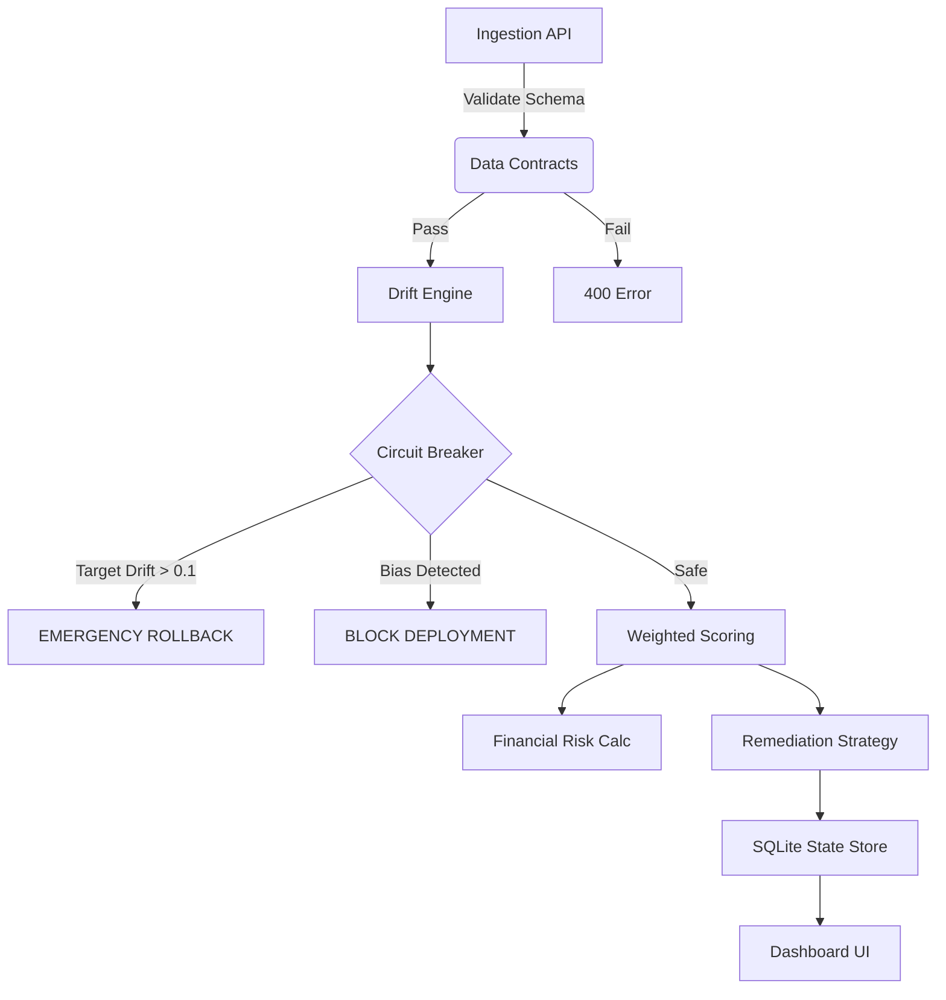

# 🛡️ ModelGuard AI: Enterprise Observability & Remediation Platform


> **A production-grade ML reliability platform that bridges the gap between passive monitoring and active remediation.**

---

## 🎥 Platform Demo

<video src="project_new.mp4" controls="controls" style="max-width: 100%;">
  Your browser does not support the video tag.
</video>

## 🎥 Platform Demo

<video src="demo.mp4" controls="controls" style="max-width: 100%;">
  Your browser does not support the video tag.
</video>

*(Note: If the video does not render on GitHub mobile, please view on desktop)*

---

## 📋 Executive Summary

**ModelGuard AI** is not just a dashboard; it is an automated **Reliability Engineer** for Machine Learning pipelines. 

While standard tools only visualize statistical drift, ModelGuard implements **Causal Logic** to quantify financial risk, enforce **Data Contracts**, and autonomously trigger remediation pipelines (Rollback, Shadow Mode, Retraining). It features a **Circuit Breaker** architecture to prevent catastrophic failure modes (e.g., Target Drift) that standard aggregated metrics often miss.

---

## 🚀 Key Enterprise Features

### 1. ⛔ Circuit Breaker Architecture (The "Kill Switch")
Passive monitoring isn't enough. ModelGuard implements a **Hard Override** logic gate.
*   **Logic:** If `Target Drift` (Label Shift) > `0.1`, the system triggers an **Emergency Rollback** immediately.
*   **Why:** Averages lie. If 9 features are stable but the Target flips, the average risk score looks low, but the model is useless. We prioritize failure modes.

### 2. 🛡️ Data Contracts (The Gatekeeper)
Prevents "Garbage In, Garbage Out" using strict **Pydantic** schemas.
*   **Action:** Validates incoming batches against defined schemas (e.g., `age >= 17`, `capital-gain >= 0`).
*   **Result:** Invalid data is rejected with `400 Bad Request` before it pollutes the inference engine.

### 3. 💸 Financial Risk Engine
Translates abstract statistical metrics into C-Suite ready KPIs.
*   **Formula:** `Risk = Volume × Avg Cost of Error ($150) × (Drift Score × Error Correlation)`
*   **Impact:** Moves the conversation from "KL Divergence is up" to "We are risking $125k/day."

### 4. ⚖️ Fairness & Ethics Auditor
Automatically scans for **Disparate Impact** on protected groups (Race/Sex).
*   **Metric:** Disparate Impact Ratio (DIR).
*   **Rule:** If `DIR < 0.8` (The 4/5ths Rule), deployment is blocked via the **FairnessMonitor** engine.

### 5. 🧠 Deterministic Decision Engine
Replaces vague alerts with explicit, rule-based pipeline triggers:
*   *Weighted Risk > 65* → **Trigger Canary Deployment**
*   *Bias Detected* → **Block Deployment & Notify Legal**
*   *Target Drift* → **Kill Traffic & Rollback**

---

## 🏗️ System Architecture

ModelGuard uses a modular architecture designed for scalability and state management.



---

## 🛠️ Tech Stack

| Component | Technology | Purpose |
| :--- | :--- | :--- |
| **Backend** | `FastAPI`, `Uvicorn` | High-performance async API. |
| **Validation** | `Pydantic` | Strict Data Contracts and Schema enforcement. |
| **Math Kernel** | `Evidently AI`, `SciPy`, `NumPy` | KS-Tests, P-Values, Drift Calculation. |
| **State** | `SQLite` | Embedded audit logs, versioning, and cooldown tracking. |
| **Frontend** | `Vanilla JS`, `CSS3` | Lightweight, no-build-step Glassmorphism UI. |
| **Container** | `Docker`, `Docker Compose` | Portable deployment. |

---

## ⚡ Quick Start

### Option A: Local Python Setup
```bash
# 1. Clone & Install
git clone https://github.com/yourusername/modelguard.git
cd modelguard
python -m venv venv
source venv/bin/activate  # or venv\Scripts\activate on Windows
pip install -r requirements.txt

# 2. Download Demo Data (Adult Census & Housing)
python scripts/download_data.py

# 3. Run Server
uvicorn app.main:app --reload
```

### Option B: Docker Deployment
```bash
# Build and Run
docker-compose up --build
```

Access the dashboard at `http://localhost:8000`.

---

## 🕵️‍♂️ Analyst Mode (SQL Interface)

ModelGuard includes an embedded SQL engine allowing Data Analysts to query drift data directly.

**Example Endpoint:** `POST /api/sql`
```json
{
  "query": "SELECT occupation, count(*) as vol FROM current_table WHERE class = '>50K' GROUP BY occupation ORDER BY vol DESC LIMIT 5"
}
```
*Use Case: Identifying exactly which user segment is driving the revenue risk.*

---

## 🧪 Statistical Rigor

We don't just guess; we prove significance.
*   **Kolmogorov-Smirnov (KS) Test:** Calculated for numerical features to ensure drift isn't just random noise.
*   **P-Values:** Exposed in the dashboard console (`F12`) for Data Science deep-dives.

---

## 📂 Project Structure

```text
├── app/
│   ├── api/
│   │   └── routes.py         # Endpoints (Ingest, SQL, Analysis)
│   ├── core/
│   │   ├── drift_engine.py   # The Brain (Math + Logic + Circuit Breaker)
│   │   ├── schemas.py        # Data Contracts (Pydantic)
│   │   ├── database.py       # State Management (SQLite)
│   │   └── registry.py       # Artifact Versioning
│   ├── static/               # Frontend Assets
│   └── main.py               # Entry point
├── data/                     # Local datasets
├── tests/                    # Pytest suite
├── project_new.mp4           # Demo Video
├── docker-compose.yml        # Orchestration
└── requirements.txt          # Dependencies
```

---

## 👤 Author

**Salma S**  


Built to demonstrate how **Production ML** requires more than just models—it requires **Systems Thinking**.
